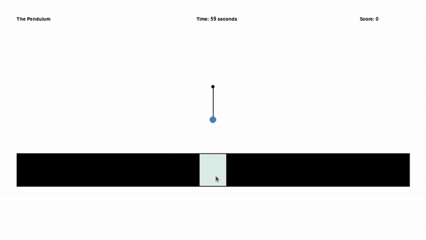
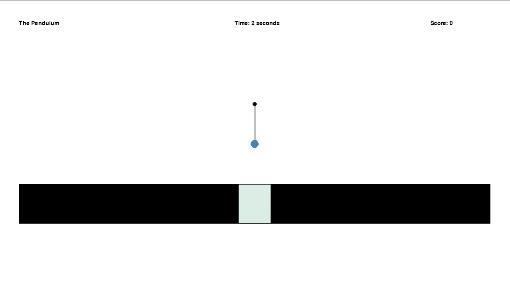
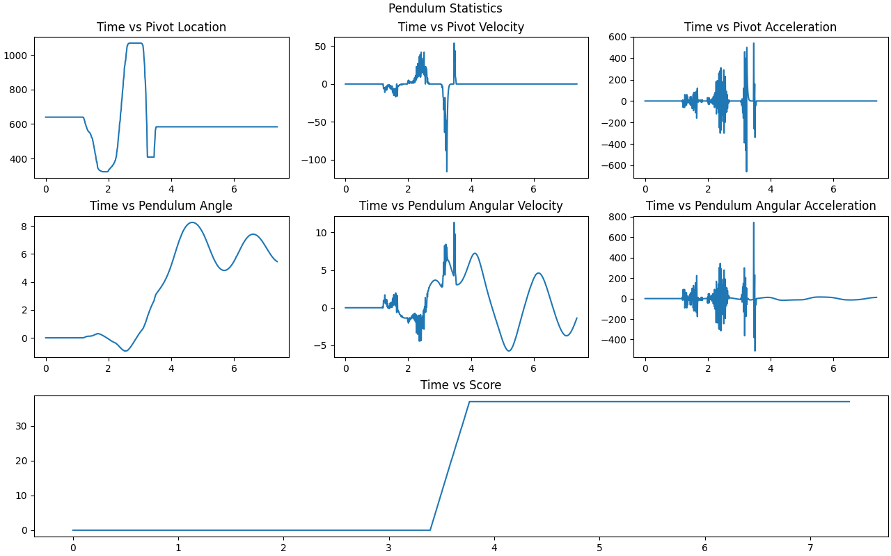

# Overview
This repository consists of 3 modules. 
- Pendulum Engine
- Neat Model
- OpenAIGym Implementation

### Pendulum Engine
Basic interactive pendulum physics simulator that is based on Euler's Method to approximate a single pendulum's motion with respect to a horizontal force acting on the base of the pendulum. 
The simulation is implemented using Pygame and Numpy. This pendulum engine acts as an environment for reinforcement learning models to train and run on. The engine has a statistics reporter and scoring criteria (points awarded based on the pendulum being balanced upright)

### Neat Model 
A NEAT model can be run and trained on the Pendulum Engine using the neat-python library. However, the model performs undesired actions when trained. Most noticeably spinning the pendulum as fast as it can to earn points. 

### OpenAIGym Implementation
In its current form, it does not integrate with the Pendulum Engine. The model interacts with the OpenAIGym environment. The implementation utilizes a Neural Network which uses the REINFORCE algorithm implemented using Keras.

# Running and Testing
The three components in this repository are split into modules and can be accessed as such. Two scripts can run and be used to test the models. It is important to install relevant package dependencies before running - which can be found in the pyproject.toml.  

### Running NEAT
The following commands can be used to run the pendulum engine and/or NEAT Model. Can be customised depending on the arguments passed. 
1. cd into src directory
2. run `python3 -m neat_model.neat-tests` will run the pendulum simulation with statistics output as default. (Arguments can be passed to change the behaviour)

Arguments are as follows:
"sim" - for running pendulum simulation

"model-train" - for training model
"model-run" - for running the trained model to control the pendulum simulation

"stat" - for enabling output of simulation statistics 

default  args are: "engine" "stat"

### Running OpenAIGym
The following commands can be used to run the OpenAIGym implementation
1. cd into src directory
2. run `python3 -m openAIGym.gym-tests` which would run the simulations using a basic hard-coded policy. Arguments can be passed to change the behaviour

Arguments are as follows:
- "<num>" - first argument (for determining how many simulations to run)
- "sim"
- "model-train"
- "model-run"

